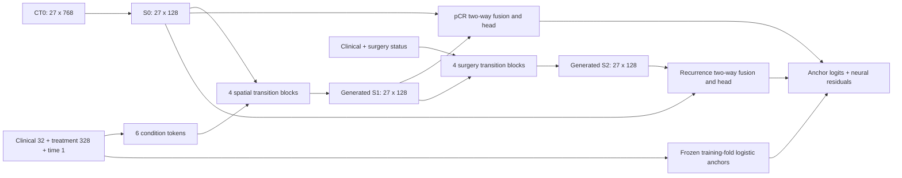

# Network

The selected model is G2 with four S1 and four S2 transition blocks.

CT0 is a frozen encoder feature grid. `FutureWorld` projects 768 to 128 and adds
3D position encoding. Each `SpatialTransition` combines four-head Transformer
attention, depthwise 3D convolutions with dilation 1/2, condition-dependent FiLM
and a residual pointwise convolution. The S1 decoder predicts CT1 features as a
residual over CT0. Real CT1 is a training target, not an inference input.

S2 conditions contain baseline clinical features and a four-state surgery
embedding (absent/present/unknown/conflict). Its final residual is initialized
to zero. Only present surgery activates the transition. The pCR branch uses
S0/S1 and cannot read S2. The recurrence branch uses S0/S2. Endpoint-specific
two-way attention, gated pooling and MLPs predict residual logits added to fixed
training-fold logistic anchors, with alpha 1.0.

Stage 1 minimizes the existing CT feature-set loss. Stage 2 jointly updates
world, S2 and heads using balanced BCE for each endpoint plus 0.1 times CT loss.
Stage 1 learning rate is 2e-4; stage 2 world/head+S2 rates are 2e-5/2e-4.
Batch size is 4, weight decay 0.01, head dropout 0.2, maximum 400 epochs per
phase, patience 50, min_delta 1e-4, gradient clipping 1, decision threshold 0.5.

All historical subjects had surgery. This experiment does not identify the
causal effect of surgery. Recurrence is a recorded binary status, not a
time-to-event endpoint with censoring.
